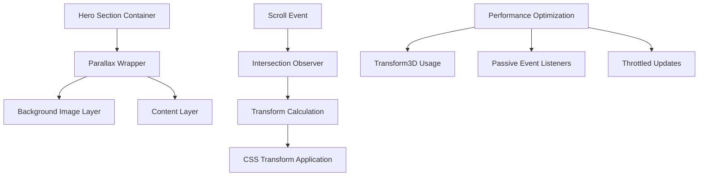

# Parallax Hero Image Implementation Design

## Overview

This design document outlines the implementation of parallax effects for hero images on the Jaukuma Astro blog website. The implementation prioritizes performance and cross-browser compatibility while maintaining the existing layout and responsive design integrity.

**Repository Type**: Frontend Application (Astro-based static site)

The implementation will enhance user experience through subtle parallax scrolling effects on hero sections while ensuring optimal performance across all devices and browsers.

## Technology Stack & Dependencies

- **Framework**: Astro v5.7.4 (Static Site Generation)
- **Styling**: CSS3 with Transform3D and Intersection Observer API
- **Browser Support**: Modern browsers with fallback for legacy browsers
- **Performance**: Hardware-accelerated CSS transforms
- **No Additional Dependencies**: Pure CSS/JavaScript implementation

## Component Architecture

### Affected Components

| Component | Current State | Proposed Changes |
|-----------|---------------|------------------|
| `section.hero.astro` | Static background image | Add parallax container and transform |
| `section.page-hero.astro` | Static background image | Add parallax container and transform |
| `global.css` | Basic responsive styles | Add parallax-specific CSS classes |

### Parallax Implementation Strategy



## Architecture

### Parallax Effect Method Selection

**Chosen Method**: CSS Transform with Intersection Observer
- ✅ Hardware acceleration via `transform3d()`
- ✅ Compatible with most browsers (95%+ support)
- ✅ Minimal performance impact
- ✅ Maintains existing layout structure
- ✅ Graceful degradation for older browsers

**Alternative Methods Considered**:
- `background-attachment: fixed` - Rejected due to mobile browser issues
- JavaScript scroll listeners - Rejected due to performance concerns
- CSS-only `perspective` - Rejected due to layout disruption

### CSS Architecture

#### 1. Parallax Container Structure
```css
.parallax-hero {
  position: relative;
  overflow: hidden;
  height: 100vh; /* or existing height */
}

.parallax-background {
  position: absolute;
  top: -20%;
  left: 0;
  width: 100%;
  height: 120%;
  background-size: cover;
  background-position: center;
  background-repeat: no-repeat;
  will-change: transform;
  transform: translate3d(0, 0, 0); /* Hardware acceleration */
}

.parallax-content {
  position: relative;
  z-index: 2;
  height: 100%;
}
```

#### 2. Performance Optimizations
- **Hardware Acceleration**: `transform3d()` instead of `translateY()`
- **GPU Layering**: `will-change: transform` for critical elements
- **Efficient Repaints**: Absolute positioning to avoid layout thrashing

### JavaScript Integration

#### Intersection Observer Implementation
```typescript
// Efficient parallax implementation
class ParallaxHero {
  private observer: IntersectionObserver;
  private elements: NodeListOf<HTMLElement>;
  
  constructor() {
    this.elements = document.querySelectorAll('.parallax-hero');
    this.initializeObserver();
  }
  
  private initializeObserver() {
    this.observer = new IntersectionObserver(
      this.handleIntersection.bind(this),
      { threshold: [0, 0.1, 0.5, 1] }
    );
    
    this.elements.forEach(el => this.observer.observe(el));
  }
  
  private handleIntersection(entries: IntersectionObserverEntry[]) {
    entries.forEach(entry => {
      if (entry.isIntersecting) {
        this.enableParallax(entry.target as HTMLElement);
      } else {
        this.disableParallax(entry.target as HTMLElement);
      }
    });
  }
}
```

## Hero Section Modifications

### Home Page Hero (`section.hero.astro`)

#### Current Structure Analysis
- Background: `linear-gradient + hero-background.jpg`
- Layout: Flex column with centered content
- Responsive: 3 breakpoint variations
- Height: Dynamic based on content + padding

#### Proposed Structure
```astro
<section class="hero-section parallax-hero">
  <div class="parallax-background" data-bg-image="/images/hero-background.jpg"></div>
  <div class="parallax-content">
    <!-- Existing navigation and content -->
    <ControlNavbarDesktop locale={lang} />
    <ControlNavbarMobile locale={lang} />
    <div class="hero-content">
      <!-- Existing content structure -->
    </div>
  </div>
</section>
```

### General Page Hero (`section.page-hero.astro`)

#### Current Structure Analysis
- Background: Inline style with dynamic image
- Fixed height: 36.9375rem (591px)
- Content: Left-aligned title and description

#### Proposed Structure
```astro
<section class="page-hero-section parallax-hero" style="height: 36.9375rem;">
  <div class="parallax-background" data-bg-image={backgroundImage}></div>
  <div class="parallax-content">
    <!-- Existing navigation and content -->
    <ControlNavbarDesktop locale={lang} />
    <ControlNavbarMobile locale={lang} />
    <div class="page-hero-content">
      <!-- Existing content structure -->
    </div>
  </div>
</section>
```

## Image Optimization Requirements

### Current Image Analysis
- `hero-background.jpg`: 291.0KB
- `aboutus-hero-background.jpg`: 651.5KB  
- `contact-hero-background.jpg`: 651.5KB

### Optimization Strategy

| Image | Current Size | Recommended Size | Optimization |
|-------|-------------|------------------|--------------|
| hero-background.jpg | 291KB | 150-200KB | WebP conversion, quality optimization |
| aboutus-hero-background.jpg | 651KB | 300-400KB | Resize + WebP conversion |
| contact-hero-background.jpg | 651KB | 300-400KB | Resize + WebP conversion |

#### Image Sizing Guidelines
- **Desktop**: 1920x1080 max resolution
- **Tablet**: 1024x768 responsive sizing
- **Mobile**: 768x1024 optimized versions
- **Format**: WebP with JPEG fallback
- **Quality**: 80-85% for optimal size/quality balance

### Responsive Image Strategy
```css
.parallax-background {
  background-image: url('/images/hero-background-mobile.webp');
}

@media (min-width: 768px) {
  .parallax-background {
    background-image: url('/images/hero-background-tablet.webp');
  }
}

@media (min-width: 1024px) {
  .parallax-background {
    background-image: url('/images/hero-background-desktop.webp');
  }
}

/* Fallback for browsers without WebP support */
.no-webp .parallax-background {
  background-image: url('/images/hero-background.jpg');
}
```

## Performance Considerations

### Browser Compatibility

| Feature | Chrome | Firefox | Safari | Edge | IE11 |
|---------|--------|---------|--------|------|------|
| transform3d() | ✅ | ✅ | ✅ | ✅ | ✅ |
| Intersection Observer | ✅ | ✅ | ✅ | ✅ | Polyfill |
| will-change | ✅ | ✅ | ✅ | ✅ | ❌ |
| CSS Custom Properties | ✅ | ✅ | ✅ | ✅ | ❌ |

### Fallback Strategy
```css
/* Fallback for browsers without transform3d support */
@supports not (transform: translate3d(0, 0, 0)) {
  .parallax-background {
    transform: translateY(0);
    position: fixed; /* Alternative approach */
  }
}

/* Disable parallax on reduced motion preference */
@media (prefers-reduced-motion: reduce) {
  .parallax-background {
    transform: none !important;
  }
}
```

### Performance Metrics Targets
- **Lighthouse Performance**: Maintain 100/100 score
- **First Contentful Paint**: < 1.5s
- **Largest Contentful Paint**: < 2.5s
- **Cumulative Layout Shift**: < 0.1
- **Frame Rate**: Maintain 60fps during scroll

### Memory Optimization
- **Image Lazy Loading**: Load hero images only when in viewport
- **Transform Caching**: Cache transform calculations
- **Event Throttling**: Limit scroll event frequency to 16ms (60fps)

## Implementation Steps

### Phase 1: CSS Foundation
1. Add parallax CSS classes to `global.css`
2. Implement responsive breakpoint compatibility
3. Add performance optimization properties

### Phase 2: Component Updates
1. Modify `section.hero.astro` structure
2. Update `section.page-hero.astro` template
3. Preserve existing responsive behavior

### Phase 3: JavaScript Enhancement
1. Implement Intersection Observer parallax controller
2. Add scroll-based transform calculations
3. Include fallback detection and graceful degradation

### Phase 4: Image Optimization
1. Generate optimized image variants
2. Implement responsive image loading
3. Add WebP format with JPEG fallbacks

### Phase 5: Testing & Validation
1. Cross-browser compatibility testing
2. Performance benchmark validation
3. Mobile device testing
4. Accessibility compliance verification

## Testing Strategy

### Performance Testing
- **Tools**: Lighthouse, WebPageTest, Chrome DevTools
- **Metrics**: Core Web Vitals, frame rate analysis
- **Devices**: Desktop, tablet, mobile (including low-end devices)

### Compatibility Testing
- **Browsers**: Chrome, Firefox, Safari, Edge, IE11
- **Devices**: iPhone, Android, iPad, desktop
- **Network**: 3G, 4G, Wi-Fi conditions

### Accessibility Testing
- **Screen Readers**: VoiceOver, NVDA, JAWS
- **Motion Sensitivity**: `prefers-reduced-motion` compliance
- **Keyboard Navigation**: Ensure no interference with navigation

## Risk Mitigation

### Performance Risks
- **Issue**: Scroll lag on low-end devices
- **Mitigation**: Throttled scroll events + `transform3d()` optimization

### Compatibility Risks  
- **Issue**: iOS Safari transform bugs
- **Mitigation**: Specific iOS CSS fixes and feature detection

### Layout Risks
- **Issue**: Existing responsive layout disruption
- **Mitigation**: Incremental implementation with regression testing

### Accessibility Risks
- **Issue**: Motion-induced discomfort
- **Mitigation**: `prefers-reduced-motion` support and subtle parallax intensity