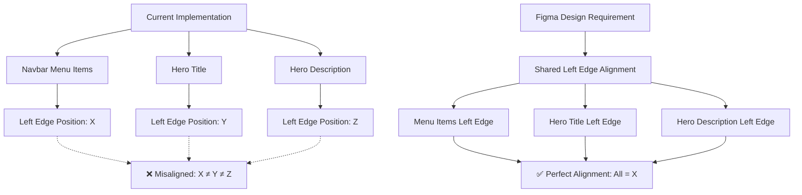
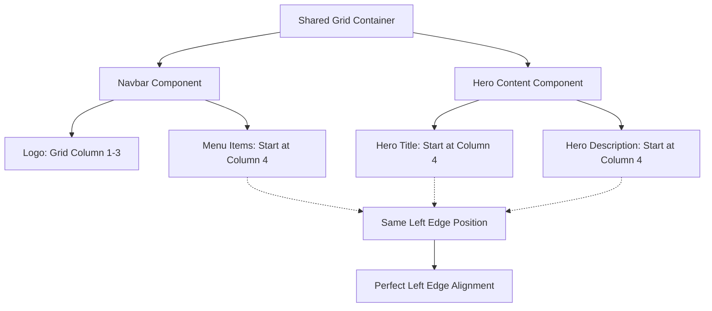

# Responsive Hero Alignment Design

## Overview

This design addresses the specific alignment issue where hero title and description elements do not align with the navigation menu items. Based on the Figma design requirements, the hero content (title and description) must share the same grid alignment as the navbar components to create visual harmony. The current implementation uses independent layout systems for navbar and hero content, resulting in misaligned text elements.

**Key Requirement**: Hero title and description left edges must align precisely with the beginning (left edge) of the navigation menu items on desktop and tablet breakpoints while maintaining mobile's current left-aligned behavior.

**Figma Design Reference**: `https://www.figma.com/design/zibgZfGq90Lr9kUljvhDLn/jaukuma.lt--BERNITIS-?node-id=4039-2573`

## Repository Type

**Frontend Application** - Astro-based static site with responsive design components

## Technology Stack

- **Frontend Framework**: Astro v5.7.4
- **Styling**: CSS with custom responsive breakpoints
- **Languages**: TypeScript, CSS
- **Components**: Astro component architecture

## Architecture

### Problem Statement



### Target Solution



## Component Architecture

### 1. Grid System Definition

A CSS Grid foundation will be established to provide consistent column alignment across navbar and hero content components.

#### Grid Specifications
- **Desktop (≥1024px)**: 12-column grid with defined gutters
- **Tablet (768px-1024px)**: 8-column grid with adjusted spacing
- **Mobile (<768px)**: Single column, left-aligned (no grid constraints)

#### Grid Structure
```css
.hero-grid-container {
  display: grid;
  grid-template-columns: repeat(12, 1fr);
  gap: 2rem;
  width: 100%;
  max-width: var(--max-page-width);
  margin: 0 auto;
}

@media (min-width: 768px) and (max-width: 1024px) {
  .hero-grid-container {
    grid-template-columns: repeat(8, 1fr);
    gap: 1.5rem;
  }
}

@media (max-width: 768px) {
  .hero-grid-container {
    display: block;
    padding: 0 1.5rem;
  }
}
```

### 2. Navbar Grid Integration

The desktop navbar component will be analyzed to determine its current layout positioning, then the grid system will be designed to match the existing visual placement.

#### Current Navbar Analysis
- **Existing Layout**: Uses flexbox with `justify-content: space-between`
- **Logo Position**: Fixed position on the left
- **Menu Position**: Current right-aligned position must be preserved
- **Visual Spacing**: Current gaps and positioning must remain identical

#### Grid Adaptation Strategy
- **Preserve Current Layout**: Grid columns will be calculated to match existing menu positioning
- **Logo Area**: Grid columns sized to accommodate current logo placement
- **Menu Area**: Grid columns positioned to maintain current menu right-alignment
- **No Visual Changes**: Grid serves as positioning reference only

#### Implementation Pattern
```css
.nav-container {
  display: grid;
  grid-template-columns: auto 1fr; /* Flexible to match current layout */
  align-items: center;
  gap: 53px; /* Preserve existing gap */
}

.logo-section {
  /* Maintains current logo positioning */
}

.nav-menu-section {
  display: flex;
  justify-content: flex-end; /* PRESERVE current right alignment */
  align-items: center;
  gap: 24px; /* Maintain existing menu spacing */
}

/* Grid measurement for hero alignment */
.nav-menu-section::before {
  content: '';
  position: absolute;
  /* Used to calculate menu start position for hero alignment */
}
```

### 3. Hero Content Grid Integration

The hero content will be positioned to align with the first navigation menu item's left edge, calculated from the current navbar layout.

#### Hero Text Alignment Strategy
- **Position Detection**: Calculate where the first menu item begins in current navbar
- **Hero Title**: Left edge aligns exactly with first navigation menu item
- **Hero Description**: Left edge aligns exactly with first navigation menu item
- **Button Elements**: Maintains left alignment within text content area
- **Layout Preservation**: No changes to navbar visual positioning
- **Precise Alignment**: Hero text starts at measured menu beginning position

#### Implementation Pattern
```css
.hero-content {
  /* Calculate left offset to match menu start position */
  margin-left: var(--menu-start-offset); /* Calculated value */
  display: flex;
  flex-direction: column;
  align-items: flex-start;
  text-align: left;
}

.hero-title,
.hero-description {
  align-self: flex-start;
  text-align: left;
  margin-left: 0;
  padding-left: 0;
  max-width: 60%; /* Prevent overly wide text */
}

.hero-button {
  align-self: flex-start;
  margin-top: 2rem;
  margin-left: 0;
}

/* CSS Custom Property calculation */
:root {
  --menu-start-offset: calc(/* logo width + gap + calculated menu start */); 
}

@media (min-width: 768px) and (max-width: 1024px) {
  :root {
    --menu-start-offset: calc(/* tablet calculation */);
  }
}

@media (max-width: 768px) {
  .hero-content {
    margin-left: 0; /* Mobile maintains current behavior */
    align-items: flex-start;
    text-align: left;
  }
}
```

## Responsive Behavior

### Desktop (≥1024px)
- **Navbar**: Maintains current visual layout and positioning (no changes)
- **Menu Position**: Current right-aligned menu positioning preserved
- **Hero Content**: Left edge aligns with calculated first menu item position
- **Alignment Method**: CSS offset calculation based on current navbar measurements
- **Visual Result**: Hero text aligns with menu beginning without changing navbar

### Tablet (768px-1024px)  
- **Navbar**: Maintains current tablet navbar layout (no changes)
- **Menu Position**: Current tablet menu positioning preserved
- **Hero Content**: Left edge aligns with calculated first menu item position
- **Alignment Method**: CSS offset calculation adapted for tablet measurements
- **Visual Result**: Hero text aligns with menu beginning without changing navbar

### Mobile (<768px)
- **Layout**: No changes to existing mobile implementation
- **Navbar**: Uses existing mobile navbar component (unchanged)
- **Hero Content**: Current left-aligned implementation preserved
- **Behavior**: No modifications to mobile layout or alignment

## Breakpoint Integration

### Existing Breakpoint System
Leverages the current BREAKPOINTS constant from `src/lib/constants.ts`:

```typescript
export const BREAKPOINTS = {
  xs: 376,
  sm: 640,
  md: 768,    // Mobile/Tablet boundary
  lg: 1024,   // Tablet/Desktop boundary
  xl: 1280,
  '2xl': 1536,
} as const;
```

### Responsive Implementation
- **Mobile**: `max-width: 767px` - maintains current behavior
- **Tablet**: `min-width: 768px` and `max-width: 1023px` - applies 8-column grid
- **Desktop**: `min-width: 1024px` - applies 12-column grid

## Implementation Strategy

### Phase 1: Current Navbar Analysis
1. Measure existing navbar layout and menu positioning
2. Calculate first menu item's left offset position
3. Document current visual spacing and gaps
4. Create CSS custom properties for calculated positions

### Phase 2: Navbar Preservation
1. Ensure `control.navbar.desktop.astro` visual layout remains unchanged
2. Add minimal measurement utilities without affecting display
3. Preserve existing flexbox layout and justification
4. Maintain current dropdown menu positioning and functionality
5. Verify no visual changes occur to navbar appearance

### Phase 3: Hero Content Alignment
1. Modify `section.hero.astro` to use calculated positioning
2. Apply CSS offset to align hero content with menu start position
3. Change hero text alignment from center to left
4. Ensure content positioning matches calculated menu position
5. Preserve existing button styling while adjusting alignment

### Phase 4: Cross-Component Integration
1. Apply grid system to other hero sections (`section.page-hero.astro`)
2. Verify consistent alignment across all hero implementations
3. Test responsive behavior across all breakpoints

## Testing Strategy

### Responsive Testing
- **Desktop Viewports**: 1920px, 1440px, 1280px, 1024px
- **Tablet Viewports**: 1024px, 768px
- **Mobile Viewports**: 767px, 375px, 320px

### Visual Alignment Verification
- **Primary Requirement**: Hero title left edge aligns exactly with first navigation menu item
- **Secondary Requirement**: Hero description left edge aligns exactly with first navigation menu item
- **Navbar Preservation**: Current navbar visual layout and positioning unchanged
- **Menu Layout**: Navigation menu maintains current right-aligned positioning
- **Consistency Check**: Hero text positioning calculated from actual navbar measurements
- **Button Alignment**: Button positioning follows same left alignment as text content
- **Desktop/Tablet**: Hero text aligns with menu beginning without modifying navbar
- **Mobile**: Preserves existing left-aligned behavior (no changes)

### Compatibility Testing
- **Navbar Preservation**: Verify no visual changes to current navbar layout
- **Menu Positioning**: Confirm current menu right-alignment is maintained
- **Dropdown Functionality**: Ensure submenu positioning remains correct
- **Parallax Compatibility**: Verify parallax functionality remains intact
- **Performance Assessment**: Confirm no impact from positioning calculations

## Accessibility Considerations

### Screen Reader Compatibility
- Grid implementation preserves semantic HTML structure
- Navigation landmarks remain accessible
- Content order maintained for assistive technologies

### Keyboard Navigation
- Tab order unaffected by grid layout changes
- Focus indicators remain visible within grid constraints
- Skip links continue to function properly

### Motion Sensitivity
- Grid alignment works with `prefers-reduced-motion` settings
- No additional motion introduced by grid system
- Maintains existing parallax motion controls