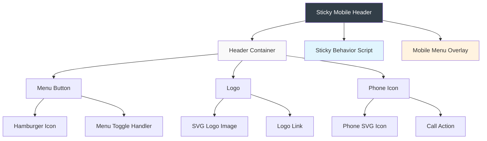
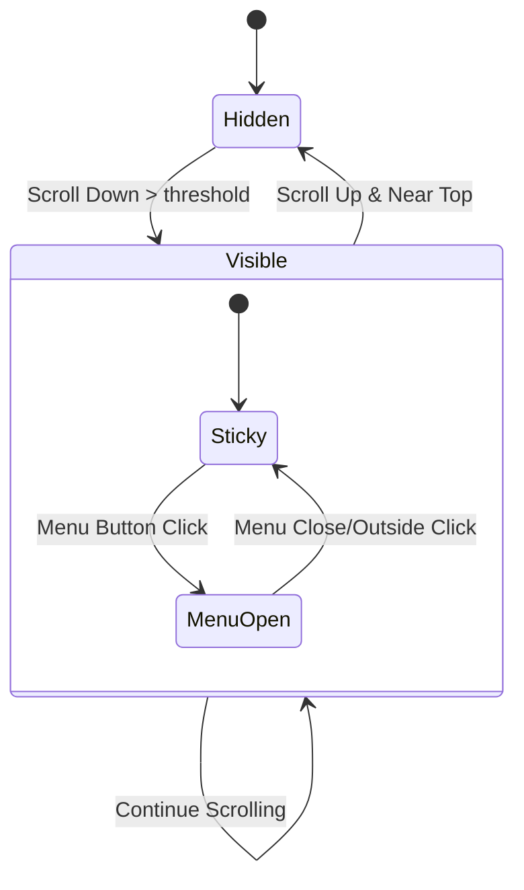

# Sticky Header Mobile Design

## Overview

This design document outlines the implementation of a sticky mobile header for the jaukuma-astro website. The header will provide persistent navigation access during scrolling, improving user experience on mobile devices by keeping essential navigation controls always accessible.

The feature addresses the need for consistent mobile navigation patterns and follows the provided Figma design specifications for visual consistency with the overall design system.

## Technology Stack & Dependencies

### Core Technologies
- **Astro Framework**: v5.7.4 - Static site generation and component architecture
- **TypeScript**: v5.8.3 - Type safety and development experience
- **CSS**: Native CSS with custom properties for styling and animations

### Integration Dependencies
- **Existing Mobile Navbar**: `control.navbar.mobile.astro` - Current mobile navigation component
- **Design System**: Constants from `src/lib/constants.ts` and color system from `src/lib/colors.ts`
- **Internationalization**: `src/lib/utils.ts` for multi-language support

## Component Architecture

### Header Component Structure



### Component Hierarchy

- **StickyHeaderMobile.astro** (New Component)
  - Header container with sticky positioning
  - Menu button with hamburger animation
  - Centered logo with navigation link
  - Phone icon with call-to-action
  - Intersection Observer for scroll behavior
  - Integration with existing mobile menu overlay

### Props & State Management

| Property | Type | Description | Default |
|----------|------|-------------|---------|
| `locale` | `string` | Current language code | `getLangFromUrl(Astro.url)` |
| `isSticky` | `boolean` | Header sticky state | Managed by scroll handler |
| `isMenuOpen` | `boolean` | Mobile menu visibility | Inherited from existing component |

## Styling Strategy

### CSS Architecture

#### Color System Integration
- **Background**: `#323E48` (Dark blue-gray from Figma)
- **Icons**: `#FFFFFF` (White for contrast)
- **Interactive States**: Existing color variables from design system

#### Layout & Positioning
```css
.sticky-header-mobile {
  position: fixed;
  top: 0;
  left: 0;
  right: 0;
  z-index: 1000;
  background: #323E48;
  border-radius: 0 0 30px 30px;
  padding: 24px;
  transform: translateY(-100%);
  transition: transform 0.3s ease-in-out;
}

.sticky-header-mobile.visible {
  transform: translateY(0);
}
```

#### Responsive Breakpoints
- **Mobile Only**: `max-width: 768px` - Header only visible on mobile devices
- **Container**: Flexbox layout with `justify-content: space-between`
- **Spacing**: 24px padding, matches Figma specifications

### Hardware Acceleration
- Use `transform3d()` for smooth animations
- GPU-accelerated transitions for sticky behavior
- Optimized for mobile performance

## State Management

### Scroll Behavior State Machine



### State Transitions
1. **Initial State**: Header hidden (transformed up)
2. **Scroll Threshold**: Show header when user scrolls down 100px
3. **Near Top**: Hide header when scrolling back to top (< 50px)
4. **Menu Integration**: Connect with existing mobile menu overlay

## API Integration Layer

### Internationalization Integration
```typescript
// Translation keys for header elements
{
  "nav.menu": "Menu",
  "nav.phone": "Call us",
  "nav.logo.alt": "Jaukuma"
}
```

### Route Integration
- Logo links to localized home page: `getLocalePath(lang, '/')`
- Phone action uses `CONTACT.PHONE` constant
- Menu button triggers existing mobile menu overlay

## Testing Strategy

### Unit Testing Approach
- **Component Rendering**: Verify header renders with correct props
- **State Management**: Test sticky behavior with scroll events
- **Accessibility**: Validate ARIA labels and keyboard navigation
- **Internationalization**: Test with all supported languages (lt, en, ru)

### Integration Testing
- **Scroll Behavior**: Simulate scroll events and verify visibility transitions
- **Menu Integration**: Test interaction with existing mobile menu overlay
- **Responsive Design**: Verify header only appears on mobile breakpoints
- **Performance**: Measure animation smoothness and GPU utilization

### Cross-Device Testing
- **iOS Safari**: Verify behavior with viewport-fit=cover
- **Android Chrome**: Test scroll performance and touch interactions
- **Reduced Motion**: Respect `prefers-reduced-motion` settings
- **Landscape Orientation**: Maintain functionality in landscape mode

## Implementation Details

### Intersection Observer Integration
```typescript
const observerOptions = {
  threshold: 0,
  rootMargin: '-50px 0px 0px 0px'
};

const observer = new IntersectionObserver((entries) => {
  entries.forEach(entry => {
    const header = document.querySelector('.sticky-header-mobile');
    if (!entry.isIntersecting) {
      header?.classList.add('visible');
    } else {
      header?.classList.remove('visible');
    }
  });
}, observerOptions);
```

### Animation Performance
- Use `transform` instead of changing `top` position
- Implement `will-change: transform` for optimization
- Add hardware acceleration with `transform3d()`
- Debounce scroll events for better performance

### Accessibility Considerations
- Maintain focus management when header appears/disappears
- Provide proper ARIA labels for all interactive elements
- Ensure sufficient color contrast ratios
- Support keyboard navigation for all actions

### Menu Button Animation
```css
.hamburger-line {
  transition: all 0.3s ease;
  transform-origin: center;
}

.menu-toggle:hover .hamburger-line {
  background-color: #D6D2C4;
}
```

### Logo Responsive Sizing
- Maintain aspect ratio from Figma: 133.23px × 53.23px
- Scale appropriately for mobile viewports
- Optimize SVG for performance and clarity

### Phone Icon Integration
- Use existing phone icon styling and behavior
- Maintain call-to-action functionality
- Apply consistent hover states and transitions